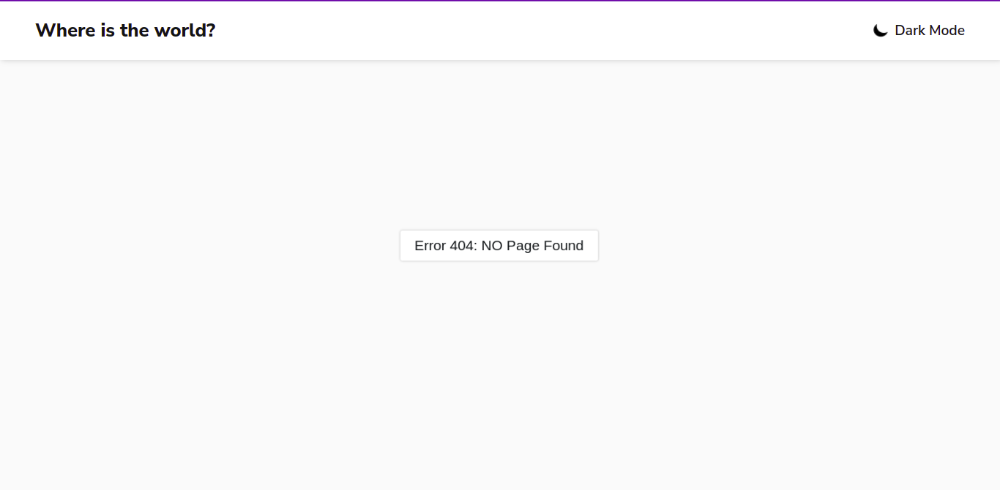

# COUNTRY APP

  
  

A React Application showing all the countries of the world fetching data from a API. 😻

[Live Link](https://country-app-pranay.herokuapp.com/) (Hosted Using Heroku)

This is a challenge from [Front End Mentor](https://www.frontendmentor.io/solutions/country-app-using-react-redux-and-react-router-dW1pmiPOz)

## Tools Used

- React
- Redux
- React Router v6
- React Hooks
- Country Api
- SASS ( for styling )

## FEATURES 👇

### Country Api

[Rest Country Api](https://restcountries.com) is used to fetch all the data.
Fetching is done in **three** ways:-
1. All the data with limited options.
2. Data of a particular country by name.
3. Data of a list of countries by their codes.

    `React Hooks` are used to mount the data after calling them. And updating only if needed.

### Multi Page Routing

There are `two` main pages in this application.
1. Homepage
2. Details Page
    This Detail page is dynamic ( passing country name as `url` as `parameter`) and display the detail of the country user wish to view.

**Also We can go back with the `Go Back` Button.**

**We can route throgh `borders` in the details page**

**There is `404 Page`**

### Searching and Filtering 

- We can search data by `Name`
- We can filter data by `Region`

This all features are setup using `Redux`. There are dedicated `dispatch` functions for many **events**.

 

**If the Searched country is not found, it displays a error message**

### Dark Theme , MicroAnimations, Load More Option

- There is Theme Preference choice.

- There are small microanimations.
- There is a special load more button on the home page which, on click, shows more countries.
[ This is hidden if all the countries are displayed ]

### Fully Responsive

## Author

Hey!! I am Pranay Raj. I am passionate in Web Devlopment and Making Creative Projects is like my hobby :)

You can connect me:

 
